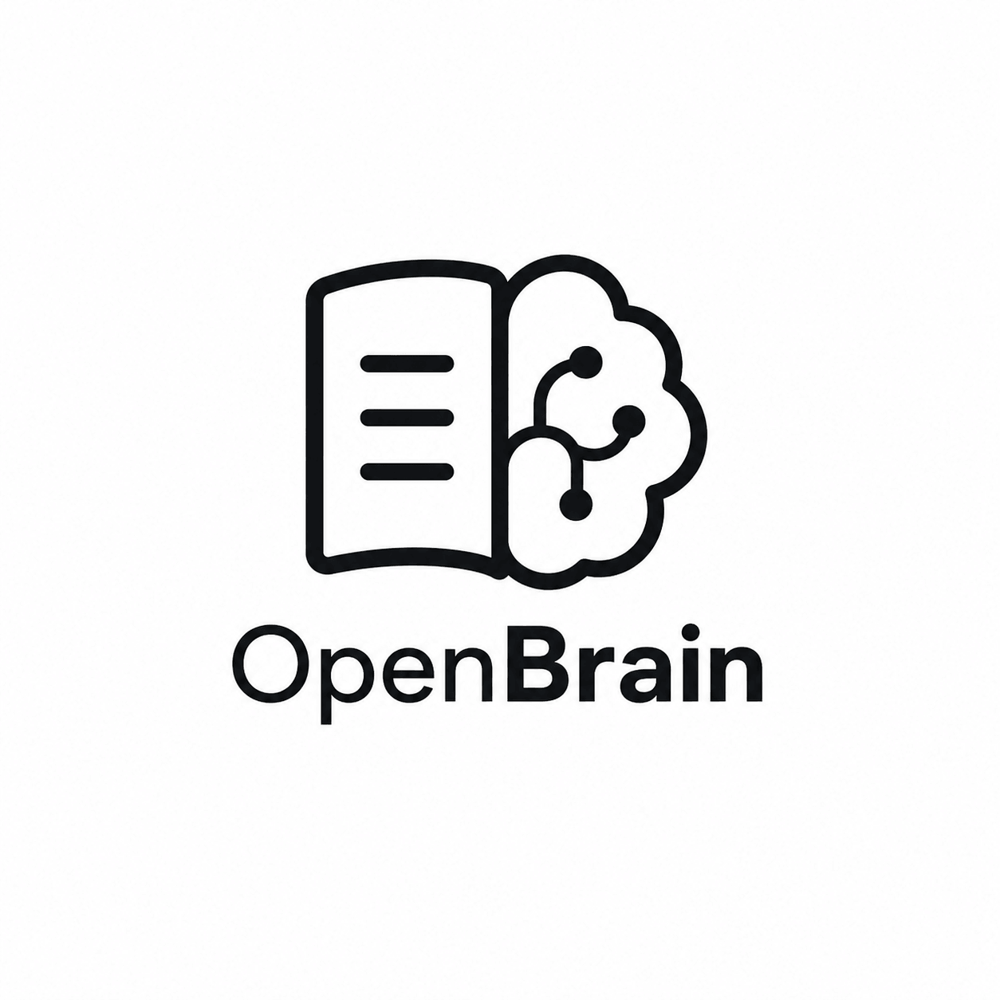

# Open Brain

<p align="center">
  
</p>

A self-organizing wiki powered by LLM and RAG. Great for people with ADHD — dump your thoughts, get instant answers, and let the AI keep everything organized.

**The core idea:** you just dump everything — links, notes, documents, random thoughts — and the AI automatically categorizes, links, and organizes it all. No folders, no tags, no friction.

## Prerequisites

- Python 3.11+
- Node.js 22+
- PostgreSQL

## Setup

### 1. Clone and configure

```bash
git clone <repo-url> && cd Open-Brain
```

### 2. Backend

```bash
cd backend

# Create virtual environment
python -m venv .venv && source .venv/bin/activate

# Install dependencies
pip install -r requirements.txt

# Configure environment
cp .env.example .env
# Edit .env with your PostgreSQL credentials and secrets

# Run migrations
alembic revision --autogenerate -m "init"
alembic upgrade head

# Start the server
uvicorn app.main:app --reload
```

Backend runs at **http://localhost:8000** — docs at http://localhost:8000/docs

### 3. Frontend

```bash
cd frontend

# Install dependencies
npm install

# Start the dev server
npm run dev
```

Frontend runs at **http://localhost:5173** — proxies `/api` to the backend at `:8000`

## Project Structure

```
Open-Brain/
├── backend/                     # FastAPI backend
│   ├── app/
│   │   ├── main.py              # App entry point, CORS, router mounts
│   │   ├── config.py            # Pydantic settings (.env)
│   │   ├── database.py          # Async SQLAlchemy engine
│   │   ├── api/                 # Route handlers
│   │   │   ├── deps.py          # Dependencies (get_db, get_current_user)
│   │   │   └── v1/              # API v1 routes
│   │   ├── models/              # SQLAlchemy ORM models
│   │   ├── schemas/             # Pydantic request/response models
│   │   ├── services/            # Business logic layer
│   │   └── utils/               # Security, email utilities
│   ├── alembic/                 # Database migrations
│   ├── .env.example             # Environment template
│   └── requirements.txt
├── frontend/                    # Vite + React + TypeScript frontend
│   ├── src/
│   │   ├── api/                 # API client + auth functions
│   │   ├── components/          # shadcn/ui primitives + AppSidebar
│   │   ├── contexts/            # Auth state provider
│   │   ├── hooks/               # TanStack Query mutations
│   │   ├── lib/                 # Utilities (cn)
│   │   ├── pages/
│   │   │   ├── auth/            # Login, Register, Forgot/Reset Password, Verify Email
│   │   │   ├── dashboard/       # Dashboard layout + page
│   │   │   ├── LandingPage.tsx  # Public landing page
│   │   │   └── NotFoundPage.tsx # 404
│   │   ├── App.tsx              # Router + route guards
│   │   └── main.tsx             # Entry point
│   ├── vite.config.ts           # Vite config (proxy /api → :8000)
│   └── package.json
└── README.md
```

## Code Conventions

- **Separation of concerns** — pages grouped by domain (`auth/`, `dashboard/`)
- **Barrel exports** — each page group has an `index.ts` exporting named defaults
- **Custom hooks** — all API calls go through TanStack Query hooks; never call `axios` directly
- **Path aliases** — use `@/` prefix (`@/components`, `@/hooks`, `@/contexts`, etc.)
- **Component naming** — PascalCase with suffix (`LoginPage`, `DashboardLayout`)
- **Styling** — Tailwind CSS + shadcn CSS variables (navy primary, indigo accent, white background)
- **Auth** — `AuthContext` manages tokens via `localStorage`; route guards wrap pages

## Environment Variables

See `backend/.env.example` for the full list. Key ones:

| Variable | Purpose |
|----------|---------|
| `SECRET_KEY` | JWT signing key |
| `POSTGRES_*` | Database connection |
| `RESEND_API_KEY` | Email delivery (Resend.com) |
| `FRONTEND_URL` | CORS origin for the frontend |
